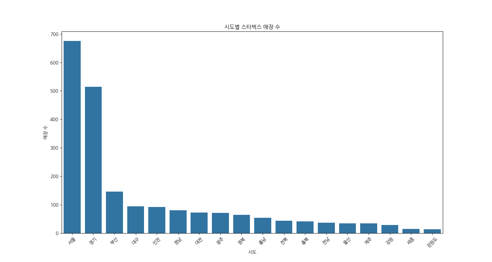
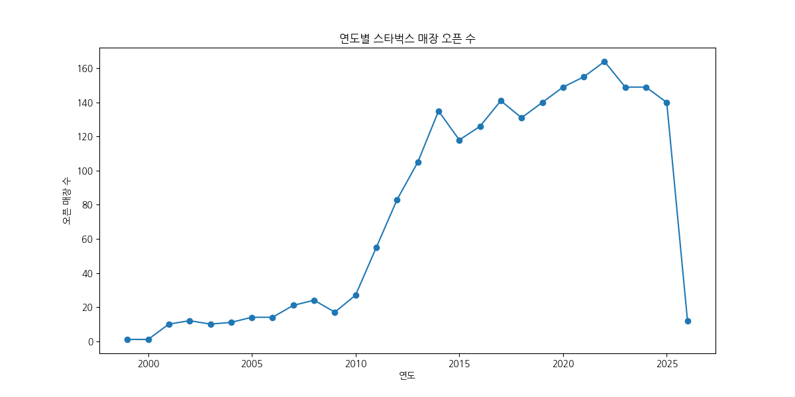

## 스타벅스 매장 데이터 분석 보고서

분석 일시: 2026-02-13 15:27:30

데이터 경로: Starbucks_WebScraping/data/starbucks_AIdata.csv

### 0. 기본 분석

#### 데이터 구조
- 전체 데이터 크기: 2114행, 137열
- 컬럼 목록: seq, sido_cd, sido_nm, gugun_cd, gugun_nm, code_order, view_yn, store_num, sido, gugun, address, new_img_nm, p_pro_seq, p_view_yn, p_sido_cd, p_gugun_cd, p_store_nm, p_theme_cd, p_wireless_yn, p_smoking_yn, p_book_yn, p_music_yn, p_terrace_yn, p_table_yn, p_takeout_yn, p_parking_yn, p_dollar_assent, p_card_recharge, p_subway_yn, stb_store_file_renew, stb_store_theme_renew, stb_store_time_renew, stb_store_lsm, s_code, s_name, tel, dlvry_call_cntr_phno, fax, sido_code, sido_name, gugun_code, gugun_name, addr, park_info, new_state, theme_state, new_bool, search_text, ins_lat, ins_lng, in_distance, out_distance, all_search_cnt, addr_search_cnt, store_search_cnt, rowCount, store_nm, store_cd, s_biz_code, new_icon, set_user, favorites, map_desc, notice, defaultimage, etcimage, in_biz_cd, in_store_cd, in_favorites, in_user_id, in_biz_cds, in_biz_arr, in_biz_arrdata, in_scodes, in_scode_arr, in_scode_arrdata, disp, set_date, hlytag, hlytag_msg, vSal, istart, iend, open_dt, gold_card, ip_lat, ip_long, espresso, new_store, premiere_food, doro_address, cold_blew, my_siren_order_store_yn, whcroad_yn, skuNo, skuName, skuImgUrl, stock_count, store_area_name, store_area_code, is_open, ev_open_yn, option, gift_stock_yn, lat, lot, t20, t04, t03, t01, t12, t09, t06, t10, p10, p50, p20, p60, p30, p70, p40, p80, t22, t21, p90, p01, t05, t30, t36, t27, t29, t43, t48, z9999, t64, t66, p02

#### 기술 통계
|       |   seq |   sido_cd |   sido_nm |   gugun_cd |   gugun_nm |   code_order |   view_yn |   store_num |   sido |   gugun |   address |   new_img_nm |   p_pro_seq |   p_view_yn |   p_sido_cd |   p_gugun_cd |   p_store_nm |   p_theme_cd |   p_wireless_yn |   p_smoking_yn |   p_book_yn |   p_music_yn |   p_terrace_yn |   p_table_yn |   p_takeout_yn |   p_parking_yn |   p_dollar_assent |   p_card_recharge |   p_subway_yn |   stb_store_file_renew |   stb_store_theme_renew |   stb_store_time_renew |   stb_store_lsm |   s_code |   dlvry_call_cntr_phno |   sido_code |   gugun_code |   park_info |   new_bool |   search_text |   ins_lat |   ins_lng |   in_distance |   out_distance |   all_search_cnt |   addr_search_cnt |   store_search_cnt |   rowCount |   store_nm |   store_cd |   s_biz_code |   set_user |   favorites |   map_desc |   notice |   etcimage |   in_biz_cd |   in_store_cd |   in_favorites |   in_user_id |   in_biz_cds |   in_biz_arr |   in_biz_arrdata |   in_scodes |   in_scode_arr |   in_scode_arrdata |   disp |   set_date |   hlytag |   hlytag_msg |   vSal |   istart |   iend |         open_dt |   gold_card |   ip_lat |   ip_long |   espresso |   new_store |   premiere_food |   cold_blew |   skuNo |   skuName |   skuImgUrl |   stock_count |   store_area_name |   is_open |   ev_open_yn |   option |   gift_stock_yn |        lat |         lot |   t20 |   t04 |   t03 |   t01 |   t12 |   t09 |   t06 |   t10 |   p10 |   p50 |   p20 |   p60 |   p30 |   p70 |   p40 |   p80 |   t22 |   t21 |   p90 |   p01 |   t05 |   t30 |   t36 |   t27 |   t29 |   t43 |   t48 |   z9999 |   t64 |   t66 |   p02 |
|:------|------:|----------:|----------:|-----------:|-----------:|-------------:|----------:|------------:|-------:|--------:|----------:|-------------:|------------:|------------:|------------:|-------------:|-------------:|-------------:|----------------:|---------------:|------------:|-------------:|---------------:|-------------:|---------------:|---------------:|------------------:|------------------:|--------------:|-----------------------:|------------------------:|-----------------------:|----------------:|---------:|-----------------------:|------------:|-------------:|------------:|-----------:|--------------:|----------:|----------:|--------------:|---------------:|-----------------:|------------------:|-------------------:|-----------:|-----------:|-----------:|-------------:|-----------:|------------:|-----------:|---------:|-----------:|------------:|--------------:|---------------:|-------------:|-------------:|-------------:|-----------------:|------------:|---------------:|-------------------:|-------:|-----------:|---------:|-------------:|-------:|---------:|-------:|----------------:|------------:|---------:|----------:|-----------:|------------:|----------------:|------------:|--------:|----------:|------------:|--------------:|------------------:|----------:|-------------:|---------:|----------------:|-----------:|------------:|------:|------:|------:|------:|------:|------:|------:|------:|------:|------:|------:|------:|------:|------:|------:|------:|------:|------:|------:|------:|------:|------:|------:|------:|------:|------:|------:|--------:|------:|------:|------:|
| count |  2114 |         0 |         0 |          0 |          0 |            0 |         0 |           0 |      0 |       0 |         0 |            0 |        2114 |           0 |           0 |            0 |            0 |            0 |               0 |              0 |           0 |            0 |              0 |            0 |              0 |              0 |                 0 |                 0 |             0 |                      0 |                       0 |                      0 |               0 |  2114    |                      0 |  2114       |     2114     |           0 |       2114 |             0 |         0 |         0 |          2114 |       2114     |             2114 |              2114 |               2114 |       2114 |          0 |       2114 |      2114    |          0 |        2114 |          0 |        0 |          0 |           0 |             0 |              0 |            0 |         2114 |            0 |                0 |        2114 |              0 |                  0 |      0 |          0 |        0 |            0 |      0 |     2114 |   2114 |  2114           |        2114 |        0 |         0 |          0 |           0 |               0 |           0 |       0 |         0 |           0 |          2114 |                 0 |         0 |            0 |        0 |               0 | 2114       | 2114        |  2114 |  2114 |  2114 |  2114 |  2114 |  2114 |  2114 |  2114 |  2114 |  2114 |  2114 |  2114 |  2114 |  2114 |  2114 |  2114 |  2114 |  2114 |  2114 |  2114 |  2114 |  2114 |  2114 |  2114 |  2114 |  2114 |  2114 |    2114 |  2114 |  2114 |  2114 |
| mean  |     0 |       nan |       nan |        nan |        nan |          nan |       nan |         nan |    nan |     nan |       nan |          nan |           0 |         nan |         nan |          nan |          nan |          nan |             nan |            nan |         nan |          nan |            nan |          nan |            nan |            nan |               nan |               nan |           nan |                    nan |                     nan |                    nan |             nan |  1412.4  |                    nan |     5.76632 |      589.451 |         nan |          0 |           nan |       nan |       nan |             0 |        106.971 |               -1 |                -1 |                 -1 |         30 |        nan |          0 |      5226.67 |        nan |           0 |        nan |      nan |        nan |         nan |           nan |            nan |          nan |            0 |          nan |              nan |           0 |            nan |                nan |    nan |        nan |      nan |          nan |    nan |        1 |     60 |     2.01792e+07 |           0 |      nan |       nan |        nan |         nan |             nan |         nan |     nan |       nan |         nan |             0 |               nan |       nan |          nan |      nan |             nan |   36.7901  |  127.404    |     0 |     0 |     0 |     0 |     0 |     0 |     0 |     0 |     0 |     0 |     0 |     0 |     0 |     0 |     0 |     0 |     0 |     0 |     0 |     0 |     0 |     0 |     0 |     0 |     0 |     0 |     0 |       0 |     0 |     0 |     0 |
| std   |     0 |       nan |       nan |        nan |        nan |          nan |       nan |         nan |    nan |     nan |       nan |          nan |           0 |         nan |         nan |          nan |          nan |          nan |             nan |            nan |         nan |          nan |            nan |          nan |            nan |            nan |               nan |               nan |           nan |                    nan |                     nan |                    nan |             nan |   680.43 |                    nan |     4.36126 |      437.28  |         nan |          0 |           nan |       nan |       nan |             0 |        125.156 |                0 |                 0 |                  0 |          0 |        nan |          0 |      2474.69 |        nan |           0 |        nan |      nan |        nan |         nan |           nan |            nan |          nan |            0 |          nan |              nan |           0 |            nan |                nan |    nan |        nan |      nan |          nan |    nan |        0 |      0 | 51976.5         |           0 |      nan |       nan |        nan |         nan |             nan |         nan |     nan |       nan |         nan |             0 |               nan |       nan |          nan |      nan |             nan |    1.03003 |    0.799346 |     0 |     0 |     0 |     0 |     0 |     0 |     0 |     0 |     0 |     0 |     0 |     0 |     0 |     0 |     0 |     0 |     0 |     0 |     0 |     0 |     0 |     0 |     0 |     0 |     0 |     0 |     0 |       0 |     0 |     0 |     0 |
| min   |     0 |       nan |       nan |        nan |        nan |          nan |       nan |         nan |    nan |     nan |       nan |          nan |           0 |         nan |         nan |          nan |          nan |          nan |             nan |            nan |         nan |          nan |            nan |          nan |            nan |            nan |               nan |               nan |           nan |                    nan |                     nan |                    nan |             nan |     3    |                    nan |     1       |      101     |         nan |          0 |           nan |       nan |       nan |             0 |          0.06  |               -1 |                -1 |                 -1 |         30 |        nan |          0 |      3001    |        nan |           0 |        nan |      nan |        nan |         nan |           nan |            nan |          nan |            0 |          nan |              nan |           0 |            nan |                nan |    nan |        nan |      nan |          nan |    nan |        1 |     60 |     1.99907e+07 |           0 |      nan |       nan |        nan |         nan |             nan |         nan |     nan |       nan |         nan |             0 |               nan |       nan |          nan |      nan |             nan |   33.2068  |  126.24     |     0 |     0 |     0 |     0 |     0 |     0 |     0 |     0 |     0 |     0 |     0 |     0 |     0 |     0 |     0 |     0 |     0 |     0 |     0 |     0 |     0 |     0 |     0 |     0 |     0 |     0 |     0 |       0 |     0 |     0 |     0 |
| 25%   |     0 |       nan |       nan |        nan |        nan |          nan |       nan |         nan |    nan |     nan |       nan |          nan |           0 |         nan |         nan |          nan |          nan |          nan |             nan |            nan |         nan |          nan |            nan |          nan |            nan |            nan |               nan |               nan |           nan |                    nan |                     nan |                    nan |             nan |   865.25 |                    nan |     1       |      119     |         nan |          0 |           nan |       nan |       nan |             0 |         10.985 |               -1 |                -1 |                 -1 |         30 |        nan |          0 |      3602.25 |        nan |           0 |        nan |      nan |        nan |         nan |           nan |            nan |          nan |            0 |          nan |              nan |           0 |            nan |                nan |    nan |        nan |      nan |          nan |    nan |        1 |     60 |     2.01412e+07 |           0 |      nan |       nan |        nan |         nan |             nan |         nan |     nan |       nan |         nan |             0 |               nan |       nan |          nan |      nan |             nan |   35.8857  |  126.926    |     0 |     0 |     0 |     0 |     0 |     0 |     0 |     0 |     0 |     0 |     0 |     0 |     0 |     0 |     0 |     0 |     0 |     0 |     0 |     0 |     0 |     0 |     0 |     0 |     0 |     0 |     0 |       0 |     0 |     0 |     0 |
| 50%   |     0 |       nan |       nan |        nan |        nan |          nan |       nan |         nan |    nan |     nan |       nan |          nan |           0 |         nan |         nan |          nan |          nan |          nan |             nan |            nan |         nan |          nan |            nan |          nan |            nan |            nan |               nan |               nan |           nan |                    nan |                     nan |                    nan |             nan |  1458.5  |                    nan |     5       |      516     |         nan |          0 |           nan |       nan |       nan |             0 |         31.16  |               -1 |                -1 |                 -1 |         30 |        nan |          0 |      4151.5  |        nan |           0 |        nan |      nan |        nan |         nan |           nan |            nan |          nan |            0 |          nan |              nan |           0 |            nan |                nan |    nan |        nan |      nan |          nan |    nan |        1 |     60 |     2.01901e+07 |           0 |      nan |       nan |        nan |         nan |             nan |         nan |     nan |       nan |         nan |             0 |               nan |       nan |          nan |      nan |             nan |   37.3843  |  127.059    |     0 |     0 |     0 |     0 |     0 |     0 |     0 |     0 |     0 |     0 |     0 |     0 |     0 |     0 |     0 |     0 |     0 |     0 |     0 |     0 |     0 |     0 |     0 |     0 |     0 |     0 |     0 |       0 |     0 |     0 |     0 |
| 75%   |     0 |       nan |       nan |        nan |        nan |          nan |       nan |         nan |    nan |     nan |       nan |          nan |           0 |         nan |         nan |          nan |          nan |          nan |             nan |            nan |         nan |          nan |            nan |          nan |            nan |            nan |               nan |               nan |           nan |                    nan |                     nan |                    nan |             nan |  1992.75 |                    nan |     8       |      835     |         nan |          0 |           nan |       nan |       nan |             0 |        232.92  |               -1 |                -1 |                 -1 |         30 |        nan |          0 |      4710.75 |        nan |           0 |        nan |      nan |        nan |         nan |           nan |            nan |          nan |            0 |          nan |              nan |           0 |            nan |                nan |    nan |        nan |      nan |          nan |    nan |        1 |     60 |     2.02206e+07 |           0 |      nan |       nan |        nan |         nan |             nan |         nan |     nan |       nan |         nan |             0 |               nan |       nan |          nan |      nan |             nan |   37.5383  |  127.452    |     0 |     0 |     0 |     0 |     0 |     0 |     0 |     0 |     0 |     0 |     0 |     0 |     0 |     0 |     0 |     0 |     0 |     0 |     0 |     0 |     0 |     0 |     0 |     0 |     0 |     0 |     0 |       0 |     0 |     0 |     0 |
| max   |     0 |       nan |       nan |        nan |        nan |          nan |       nan |         nan |    nan |     nan |       nan |          nan |           0 |         nan |         nan |          nan |          nan |          nan |             nan |            nan |         nan |          nan |            nan |          nan |            nan |            nan |               nan |               nan |           nan |                    nan |                     nan |                    nan |             nan |  2523    |                    nan |    17       |     1701     |         nan |          0 |           nan |       nan |       nan |             0 |        488.81  |               -1 |                -1 |                 -1 |         30 |        nan |          0 |      9999    |        nan |           0 |        nan |      nan |        nan |         nan |           nan |            nan |          nan |            0 |          nan |              nan |           0 |            nan |                nan |    nan |        nan |      nan |          nan |    nan |        1 |     60 |     2.02602e+07 |           0 |      nan |       nan |        nan |         nan |             nan |         nan |     nan |       nan |         nan |             0 |               nan |       nan |          nan |      nan |             nan |   38.2133  |  129.455    |     0 |     0 |     0 |     0 |     0 |     0 |     0 |     0 |     0 |     0 |     0 |     0 |     0 |     0 |     0 |     0 |     0 |     0 |     0 |     0 |     0 |     0 |     0 |     0 |     0 |     0 |     0 |       0 |     0 |     0 |     0 |

#### 결측치 및 품질 점검
결측치 수:
|                       |    0 |
|:----------------------|-----:|
| sido_cd               | 2114 |
| sido_nm               | 2114 |
| gugun_cd              | 2114 |
| gugun_nm              | 2114 |
| code_order            | 2114 |
| view_yn               | 2114 |
| store_num             | 2114 |
| sido                  | 2114 |
| gugun                 | 2114 |
| address               | 2114 |
| new_img_nm            | 2114 |
| p_view_yn             | 2114 |
| p_sido_cd             | 2114 |
| p_gugun_cd            | 2114 |
| p_store_nm            | 2114 |
| p_theme_cd            | 2114 |
| p_wireless_yn         | 2114 |
| p_smoking_yn          | 2114 |
| p_book_yn             | 2114 |
| p_music_yn            | 2114 |
| p_terrace_yn          | 2114 |
| p_table_yn            | 2114 |
| p_takeout_yn          | 2114 |
| p_parking_yn          | 2114 |
| p_dollar_assent       | 2114 |
| p_card_recharge       | 2114 |
| p_subway_yn           | 2114 |
| stb_store_file_renew  | 2114 |
| stb_store_theme_renew | 2114 |
| stb_store_time_renew  | 2114 |
| stb_store_lsm         | 2114 |
| dlvry_call_cntr_phno  | 2114 |
| gugun_name            |   15 |
| park_info             | 2114 |
| new_state             | 1507 |
| search_text           | 2114 |
| ins_lat               | 2114 |
| ins_lng               | 2114 |
| store_nm              | 2114 |
| set_user              | 2114 |
| map_desc              | 2114 |
| notice                | 2114 |
| etcimage              | 2114 |
| in_biz_cd             | 2114 |
| in_store_cd           | 2114 |
| in_favorites          | 2114 |
| in_user_id            | 2114 |
| in_biz_arr            | 2114 |
| in_biz_arrdata        | 2114 |
| in_scode_arr          | 2114 |
| in_scode_arrdata      | 2114 |
| disp                  | 2114 |
| set_date              | 2114 |
| hlytag                | 2114 |
| hlytag_msg            | 2114 |
| vSal                  | 2114 |
| ip_lat                | 2114 |
| ip_long               | 2114 |
| espresso              | 2114 |
| new_store             | 2114 |
| premiere_food         | 2114 |
| cold_blew             | 2114 |
| whcroad_yn            |  421 |
| skuNo                 | 2114 |
| skuName               | 2114 |
| skuImgUrl             | 2114 |
| store_area_name       | 2114 |
| is_open               | 2114 |
| ev_open_yn            | 2114 |
| option                | 2114 |
| gift_stock_yn         | 2114 |

제거된 컬럼 (모두 동일한 값이거나 결측치가 80% 이상): sido_cd, sido_nm, gugun_cd, gugun_nm, code_order, view_yn, store_num, sido, gugun, address, new_img_nm, p_view_yn, p_sido_cd, p_gugun_cd, p_store_nm, p_theme_cd, p_wireless_yn, p_smoking_yn, p_book_yn, p_music_yn, p_terrace_yn, p_table_yn, p_takeout_yn, p_parking_yn, p_dollar_assent, p_card_recharge, p_subway_yn, stb_store_file_renew, stb_store_theme_renew, stb_store_time_renew, stb_store_lsm, dlvry_call_cntr_phno, park_info, search_text, ins_lat, ins_lng, store_nm, set_user, map_desc, notice, etcimage, in_biz_cd, in_store_cd, in_favorites, in_user_id, in_biz_arr, in_biz_arrdata, in_scode_arr, in_scode_arrdata, disp, set_date, hlytag, hlytag_msg, vSal, ip_lat, ip_long, espresso, new_store, premiere_food, cold_blew, skuNo, skuName, skuImgUrl, store_area_name, is_open, ev_open_yn, option, gift_stock_yn

#### 데이터 타입
<class 'pandas.DataFrame'>
RangeIndex: 2114 entries, 0 to 2113
Data columns (total 69 columns):
 #   Column                   Non-Null Count  Dtype  
---  ------                   --------------  -----  
 0   seq                      2114 non-null   int64  
 1   p_pro_seq                2114 non-null   int64  
 2   s_code                   2114 non-null   int64  
 3   s_name                   2114 non-null   str    
 4   tel                      2114 non-null   str    
 5   fax                      2114 non-null   str    
 6   sido_code                2114 non-null   int64  
 7   sido_name                2114 non-null   str    
 8   gugun_code               2114 non-null   int64  
 9   gugun_name               2099 non-null   str    
 10  addr                     2114 non-null   str    
 11  new_state                607 non-null    str    
 12  theme_state              2114 non-null   str    
 13  new_bool                 2114 non-null   int64  
 14  in_distance              2114 non-null   int64  
 15  out_distance             2114 non-null   float64
 16  all_search_cnt           2114 non-null   int64  
 17  addr_search_cnt          2114 non-null   int64  
 18  store_search_cnt         2114 non-null   int64  
 19  rowCount                 2114 non-null   int64  
 20  store_cd                 2114 non-null   int64  
 21  s_biz_code               2114 non-null   int64  
 22  new_icon                 2114 non-null   str    
 23  favorites                2114 non-null   int64  
 24  defaultimage             2114 non-null   str    
 25  in_biz_cds               2114 non-null   int64  
 26  in_scodes                2114 non-null   int64  
 27  istart                   2114 non-null   int64  
 28  iend                     2114 non-null   int64  
 29  open_dt                  2114 non-null   int64  
 30  gold_card                2114 non-null   int64  
 31  doro_address             2114 non-null   str    
 32  my_siren_order_store_yn  2114 non-null   str    
 33  whcroad_yn               1693 non-null   str    
 34  stock_count              2114 non-null   int64  
 35  store_area_code          2114 non-null   str    
 36  lat                      2114 non-null   float64
 37  lot                      2114 non-null   float64
 38  t20                      2114 non-null   int64  
 39  t04                      2114 non-null   int64  
 40  t03                      2114 non-null   int64  
 41  t01                      2114 non-null   int64  
 42  t12                      2114 non-null   int64  
 43  t09                      2114 non-null   int64  
 44  t06                      2114 non-null   int64  
 45  t10                      2114 non-null   int64  
 46  p10                      2114 non-null   int64  
 47  p50                      2114 non-null   int64  
 48  p20                      2114 non-null   int64  
 49  p60                      2114 non-null   int64  
 50  p30                      2114 non-null   int64  
 51  p70                      2114 non-null   int64  
 52  p40                      2114 non-null   int64  
 53  p80                      2114 non-null   int64  
 54  t22                      2114 non-null   int64  
 55  t21                      2114 non-null   int64  
 56  p90                      2114 non-null   int64  
 57  p01                      2114 non-null   int64  
 58  t05                      2114 non-null   int64  
 59  t30                      2114 non-null   int64  
 60  t36                      2114 non-null   int64  
 61  t27                      2114 non-null   int64  
 62  t29                      2114 non-null   int64  
 63  t43                      2114 non-null   int64  
 64  t48                      2114 non-null   int64  
 65  z9999                    2114 non-null   int64  
 66  t64                      2114 non-null   int64  
 67  t66                      2114 non-null   int64  
 68  p02                      2114 non-null   int64  
dtypes: float64(3), int64(52), str(14)
memory usage: 1.1 MB

### 1. 기본 정보 요약

|    | s_name   | sido_name   | gugun_name   | doro_address               |   open_dt |     lat |     lot |
|---:|:---------|:------------|:-------------|:---------------------------|----------:|--------:|--------:|
|  0 | 역삼아레나빌딩  | 서울          | 강남구          | 서울특별시 강남구 언주로 425 (역삼동)    |  20190613 | 37.5011 | 127.043 |
|  1 | 논현역사거리   | 서울          | 강남구          | 서울특별시 강남구 강남대로 538 (논현동)   |  20181123 | 37.5102 | 127.022 |
|  2 | 신사역성일빌딩  | 서울          | 강남구          | 서울특별시 강남구 강남대로 584 (논현동)   |  20191219 | 37.5139 | 127.021 |
|  3 | 국기원사거리   | 서울          | 강남구          | 서울특별시 강남구 테헤란로 125 (역삼동)   |  20190731 | 37.4995 | 127.031 |
|  4 | 대치재경빌딩   | 서울          | 강남구          | 서울특별시 강남구 남부순환로 2947 (대치동) |  20190214 | 37.4947 | 127.063 |

- **총 매장 수**: 2114개
- **분석 지역**: 18개 시도, 157개 시군구
- **오픈일**: 19990727 ~ 20260213

## 2. 매장 특성 분석 (theme_state)
### 매장별 제공 서비스/특징 (상위 10개)
|    | theme_code   |   매장 수 |
|---:|:-------------|-------:|
|  0 | T30          |   2103 |
|  1 | T20          |   2102 |
|  2 | T17          |   2100 |
|  3 | T05          |   2082 |
|  4 | T65          |   2069 |
|  5 | T16          |   2058 |
|  6 | T08          |   2048 |
|  7 | T32          |   2038 |
|  8 | T56          |   1953 |
|  9 | T52          |   1859 |

### 3. 주변 위치적 특징 분석

| sido_name   |   매장 수 |
|:------------|-------:|
| 서울          |    675 |
| 경기          |    514 |
| 부산          |    146 |
| 대구          |     94 |
| 인천          |     92 |
| 경남          |     81 |
| 대전          |     73 |
| 광주          |     71 |
| 경북          |     64 |
| 충남          |     54 |
| 전북          |     44 |
| 충북          |     41 |
| 전남          |     37 |
| 울산          |     35 |
| 제주          |     35 |
| 강원          |     29 |
| 세종          |     15 |
| 강원도         |     14 |

| gugun_name   |   매장 수 |
|:-------------|-------:|
| 강남구          |    102 |
| 서초구          |     58 |
| 중구           |     54 |
| 영등포구         |     43 |
| 종로구          |     42 |
| 송파구          |     39 |
| 마포구          |     38 |
| 강서구          |     33 |
| 용산구          |     25 |
| 서대문구         |     24 |
| 광진구          |     23 |
| 강동구          |     20 |
| 성북구          |     17 |
| 양천구          |     17 |
| 은평구          |     16 |
| 금천구          |     15 |
| 노원구          |     15 |
| 성동구          |     15 |
| 관악구          |     14 |
| 동대문구         |     14 |
| 동작구          |     13 |
| 구로구          |     13 |
| 중랑구          |     10 |
| 도봉구          |      8 |
| 강북구          |      7 |

### 4. 오픈일 기반 통계적 해석

|   open_year |   오픈 매장 수 |
|------------:|----------:|
|        1999 |         1 |
|        2000 |         1 |
|        2001 |        10 |
|        2002 |        12 |
|        2003 |        10 |
|        2004 |        11 |
|        2005 |        14 |
|        2006 |        14 |
|        2007 |        21 |
|        2008 |        24 |
|        2009 |        17 |
|        2010 |        27 |
|        2011 |        55 |
|        2012 |        83 |
|        2013 |       105 |
|        2014 |       135 |
|        2015 |       118 |
|        2016 |       126 |
|        2017 |       141 |
|        2018 |       131 |
|        2019 |       140 |
|        2020 |       149 |
|        2021 |       155 |
|        2022 |       164 |
|        2023 |       149 |
|        2024 |       149 |
|        2025 |       140 |
|        2026 |        12 |

### 5. 주요 비즈니스 인사이트

- **수도권 집중**: 매장의 대부분이 서울 및 수도권에 집중되어 있어, 해당 지역의 시장이 매우 중요함을 시사합니다.
- **오피스 상권**: 서울의 경우 강남구, 중구, 서초구 등 오피스 밀집 지역에 매장이 많아 직장인 고객이 주요 타겟임을 알 수 있습니다.
- **성장세**: 연도별 오픈 매장 수를 보면 꾸준히 매장이 증가하고 있으며, 이는 스타벅스의 지속적인 확장 전략을 보여줍니다.
- **편의시설**: 대부분의 매장이 기본적인 편의시설을 갖추고 있으나, 특정 테마(리저브, DT 등)를 가진 매장은 소수이므로 희소성이 있습니다.

### 6. 데이터 품질 검증

- **결측치**: `open_dt`, `tel` 등 일부 컬럼에서 결측치가 발견되었습니다. 특히 `open_dt`는 시계열 분석에 중요하므로 데이터 보강이 필요합니다.
- **이상치**: 위도(lat), 경도(lot) 값이 0 또는 비정상적인 범위를 가지는 데이터가 있는지 확인이 필요합니다. 현재 분석에서는 좌표가 0인 데이터는 없었습니다.
- **코드값**: `sido_code`, `gugun_code` 등 코드값이 실제 행정 구역과 일치하는지 추가 검증이 필요할 수 있습니다.

### 7. 추가 분석 제안

- **경쟁사 분석**: 동일 지역 내 다른 커피 전문점(예: 투썸플레이스, 이디야) 데이터와 비교하여 상권 내 경쟁 강도를 분석할 수 있습니다.
- **유동인구 데이터 결합**: 각 매장 위치의 유동인구 데이터를 결합하여 매장 규모나 매출과의 상관관계를 분석할 수 있습니다.
- **테마별 고객 분석**: 리저브, DT, 커뮤니티 스토어 등 테마별 매장의 고객 특성 및 만족도를 분석하여 타겟 마케팅 전략을 수립할 수 있습니다.
- **매출 예측 모델**: 매장 특성, 위치, 주변 환경, 유동인구 등 다양한 변수를 활용하여 신규 매장의 예상 매출을 예측하는 모델을 개발할 수 있습니다.

